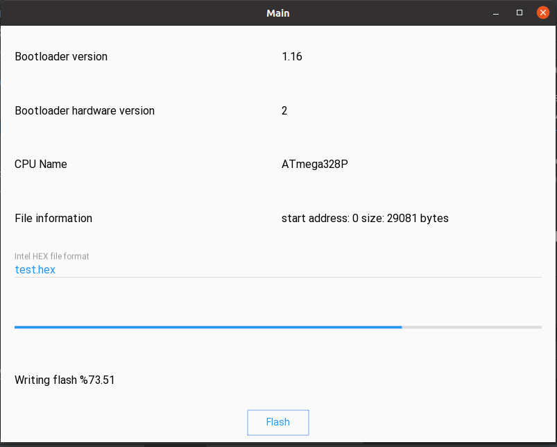

PyArduinoFlash
====


PyArduinoFlash is an open source in Python for updating the firmware 
of Arduino boards that use the ``ATmegaBOOT_168.c`` bootloader, for example [Arduino Nano](https://store.arduino.cc/usa/arduino-nano).

The intention is to have a class that can be imported into any python project to update the Arduinos through the serial port.

It implements a subset of Atmel's STK-500 protocol, using as reference the source code of all Arduino bootloaders that use Atmel as a processor. 
[ArduinoCore-avr](https://github.com/arduino/ArduinoCore-avr/blob/master/bootloaders/atmega/ATmegaBOOT_168.c)

As an example of use, there is an APP in [KivyMd](https://gitlab.com/kivymd/KivyMD) and [Kivy](http://kivy.org) that exposes through a GUI all the methods required to update and verify the firmware.



Installation
------------
Installation, Documentation and Examples
----------------------------------------
For now it consists of copying the [arduinobotloader.py](https://github.com/jjsch-dev/PyArduinoFlash/blob/master/arduinobootloader.py) file to the Python project

Documentation and Examples
----------------------------------------
```python
    from intelhex import IntelHex
    from arduinobootloader import ArduinoBootloader

    ih = IntelHex()
    ab = ArduinoBootloader()

    if ab.open():
        if ab.board_request():
            print("botloader version: {} hardware version: {}".format(ab.sw_version, ab.hw_version))
            ab.close()
            return 

        if ab.cpu_signature():
            print("cpu name: {}".format(self.ab.cpu_name) )
            ab.close()
            return

        ih.fromfile("firmware_file.hex", format='hex')
        
        for address in range(0, ih.maxaddr(), ab.cpu_page_size):
            buffer = ih.tobinarray(start=address, size=ab.cpu_page_size)
            if not ab.write_memory(buffer, address):
               print("Write error") 
               ab.leave_prg_mode()
               ab.close()
               return
        
        for address in range(0, ih.maxaddr(), ab.cpu_page_size):
            buffer = ih.tobinarray(start=address, size=ab.cpu_page_size)
            read_buffer ab.read_memory(address, ab.cpu_page_size)
            if not len(read_buffer):
               print("Read error") 
               break
               
            if buffer != read_buffer:
               print("File not match")
               break
        
        ab.leave_prg_mode()
        ab.close()
```
The parsing of the file in [Intel hexadecimal format](https://en.wikipedia.org/wiki/Intel_HEX) is done with the [IntelHex](https://github.com/python-intelhex/intelhex) library.

To have an instance of the class use ``ab = ArduinoBootloader()``
The next step is to establish the connection with the bootloader of the Arduino board with ``ab.open()`` that returns ``True`` when it is successful.

As the library needs the information of the CPU to know the size of the page, it is necessary to use the functions ``ab.board_request()`` and ``ab.cpu_signature()``

If the previous functions were executed successfully (they return ``True``), now you have to open the hexadecimal file with the ``ih.fromfile("firmware_file.hex", format='hex')`` function. If there are errors in the format or the file path is invalid, exceptions are thrown.

As the CPU flash is recorded by pages, with the function ``ih.tobinarray(start=address, size=ab.cpu_page_size)`` the current page is obtained (according to the address).

For the bootloader to write it, you have to use the function ``ab.write_memory(buffer, address)`` which take the buffer and the current address as parameters. Returns ``True`` when completed successfully.

The reading to verify the recording is done in the same way, with the exception that the function returns the buffer read. If it is ``None`` it indicates that there were problems.

The bootloader begins the execution of the firmware after a period of time without receiving communication; nevertheless it is convenient to execute the function ``ab.leave_prg_mode()``.

Finally, to release the serial port, you have to execute the function ``ab.close()``.

Support
-------

If you need assistance, contact me:

* Email      : juanschiavoni@gmail.com


Contributing
------------


Licenses
--------

- PyArduinoFlash is released under the terms of the MIT License. Please refer to the
  LICENSE file.


