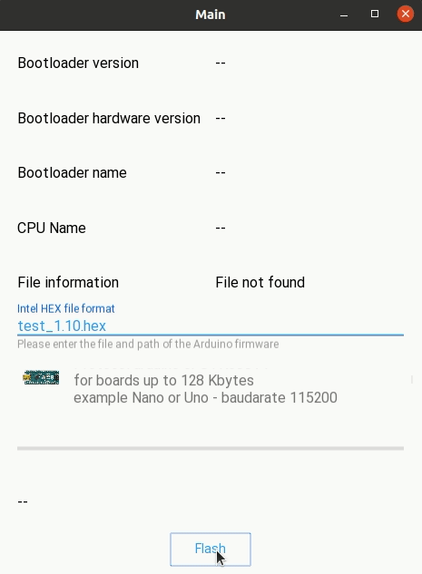
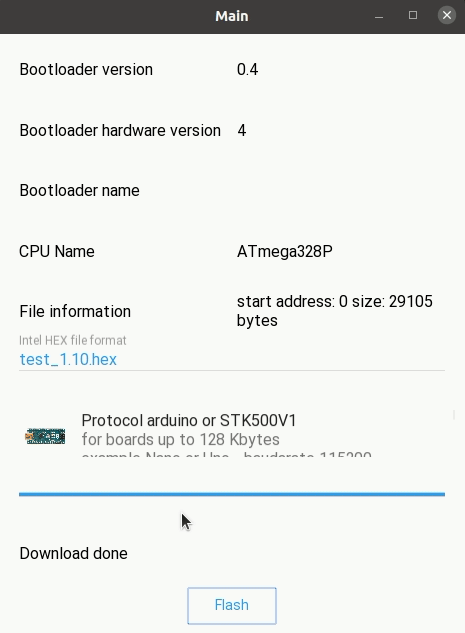
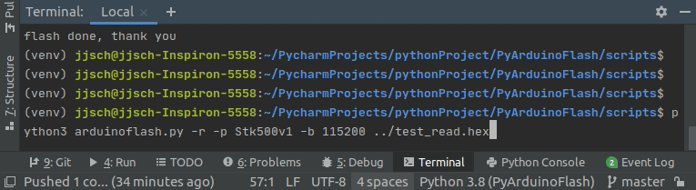
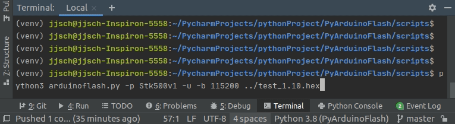
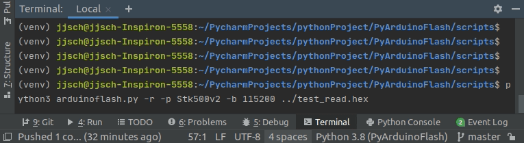
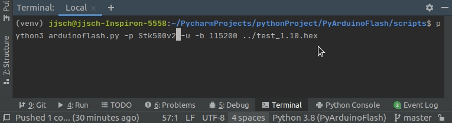

PyArduinoFlash
====


PyArduinoFlash is an open source library in Python for updating the firmware 
of Arduino boards that use the [ATmegaBOOT_168](https://github.com/arduino/ArduinoCore-avr/tree/master/bootloaders/atmega) or Arduino [Stk500V2](https://github.com/arduino/Arduino-stk500v2-bootloader) bootloader, for example [Arduino Nano](https://store.arduino.cc/usa/arduino-nano) or [Arduino Uno](https://store.arduino.cc/usa/arduino-uno-rev3) or [Arduino Mega 2560](https://store.arduino.cc/usa/mega-2560-r3) and many more.

The intention is to have a class that can be imported into any python project to update the Arduinos through the serial port.

It implements a subset of Atmel's STK-500V1 and STK500V2 protocol, using as reference the protocols implemented by [Avrdude](http://savannah.nongnu.org/projects/avrdude) in the ```arduino.c``` and ```wiring.c``` modules.

For Arduino's using Atmel AVR8 processors there are three versions of the bootoloader available. For boards that have less than 128 Kbytes of Flash memory, for example Nano or Uno using the Atmega328P, etc that are marked in the Arduino IDE as older you have to use STK500-V1 at 57600 baud. And for the new ones (they implement the Optiboot bootloader) you have to use STK500-V1 at 115200 baud. 
For boards that have processors of more than 128 Kbytes, for example the Mega 2560, the STK500-V2 protocol must be used at 115200 baud.


As an example of use, there is an APP in [KivyMd](https://gitlab.com/kivymd/KivyMD) and [Kivy](http://kivy.org) that exposes through a GUI all the methods required to update and verify the firmware.

The first example shows the upgrade of a Nano board with a new bootolader. Select STK500-V1 at 115200 baud.



The second example shows the upgrade of a Mega board with 2560 processor. STK500-V2 must be selected at 115200 baud.



Installation
------------
Install using pip or pip3 (recommended, no separate download required):

``pip install arduinobootloader`` 

Documentation and Examples
----------------------------------------
```python
    from intelhex import IntelHex
    from arduinobootloader import ArduinoBootloader

    def update(self):
        ih = IntelHex()
        ab = ArduinoBootloader()
        prg = ab.select_programmer("Stk500v1")

        if prg.open(speed=115200):
            if not prg.board_request():
                prg.close()
                return

            print("botloader name: {} version: {} hardware: {}".format(ab.programmer_name,
                                                                       ab.sw_version,
                                                                       ab.hw_version))

            if not prg.cpu_signature():
                prg.close()
                return

            print("cpu name: {}".format(ab.cpu_name) )

            try:
                ih.fromfile("filename.hex", format='hex')
            except (FileNotFoundError, AddressOverlapError, HexRecordError):
                return

            for address in range(0, ih.maxaddr(), ab.cpu_page_size):
                buffer = ih.tobinarray(start=address, size=ab.cpu_page_size)
                if not prg.write_memory(buffer, address):
                   print("Write error")
                   prg.leave_bootloader()
                   prg.close()
                   return

            for address in range(0, ih.maxaddr(), ab.cpu_page_size):
                buffer = ih.tobinarray(start=address, size=ab.cpu_page_size)
                read_buffer = prg.read_memory(address, ab.cpu_page_size)
                if read_buffer is None:
                   print("Read error")
                   break

                if buffer != read_buffer:
                   print("File not match")
                   break

            prg.leave_bootloader()
            prg.close()

```
The parsing of the file in [Intel hexadecimal format](https://en.wikipedia.org/wiki/Intel_HEX) is done with the [IntelHex](https://github.com/python-intelhex/intelhex) library.

To have an instance of the class use ``ab = ArduinoBootloader()``
Then select the protocol of the programmer ``prg = ab.select_protocol("Stk500v1") ``. To establish the connection with the bootloader of the Arduino board use ``prg.open()`` that returns ``True`` when it is successful.

As the library needs the information of the CPU to know the size and count of the flash page, use the method ``prg.board_request()`` and ``prg.cpu_signature()``

If the previous was successfully (they return ``True``), now open the hexadecimal file with the ``ih.fromfile("firmware_file.hex", format='hex')`` function. If there are errors in the format or the file path is invalid, exceptions are thrown.

To obtain the page of the current address, use the  ``ih.tobinarray(start=address, size=ab.cpu_page_size)`` .

For write it in the flash memory, use the method ``prg.write_memory(buffer, address)`` which take the buffer and the address as parameters. Returns ``True`` when success.

The read to verify is done in the same way, with the exception that the method returns the read buffer. If it is ``None`` it indicates that there were problems.

The bootloader begins the execution of the firmware after a period of time without receiving communication; nevertheless it is convenient to execute the function ``prg.leave_bootloader()``.

Call the method ``prg.close()`` to release the serial port.

Scripts
-------
The Script folder contains arduinoflash.py file that allows update or read the firmware of Arduino boards.

One of the purposes is to show the use of the PyArduinoBootloader library in conjunction with the [IntelHex](https://github.com/python-intelhex/intelhex) library to process hexadecimal files.

Use the [argparse](https://docs.python.org/3/library/argparse.html#module-argparse) library, to read the command line (file and options). 

And to indicate the progress the [progressbar2](https://pypi.org/project/progressbar2/) library.

```shell script: usage: arduinoflash.py [-h] [--version] [-r | -u] filename
usage: arduinoflash.py [-h] [--version] [-r | -u] filename

arduino flash utility

positional arguments:
  filename      filename in hexadecimal Intel format

optional arguments:
  -h, --help    show this help message and exit
  --version     script version
  -b BAUDRATE, --baudrate BAUDRATE
                        old bootolader (57600) Optiboot (115200)
  -p PROGRAMMER, --programmer PROGRAMMER
                        programmer version - Nano (Stk500v1) Mega (Stk500v2)
  -r, --read            read the cpu flash memory
  -u, --update          update cpu flash memory

```
The following capture shows the reading of the flash memory of an Arduino Nano board.



And the next shows the firmware update of an Arduino Nano board.



The following capture shows the reading of the flash memory of an Arduino Mega 2560 board.



And the next shows the firmware update of an Arduino Mega 2560 board.



Support
-------

If you need assistance, contact me:

* Email      : juanschiavoni@gmail.com


Contributing
------------


Licenses
--------

- PyArduinoFlash is released under the terms of the MIT License. Please refer to the
  LICENSE file.


