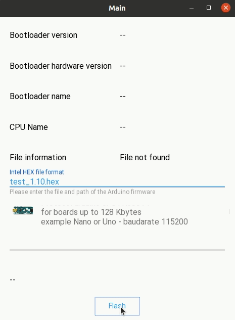
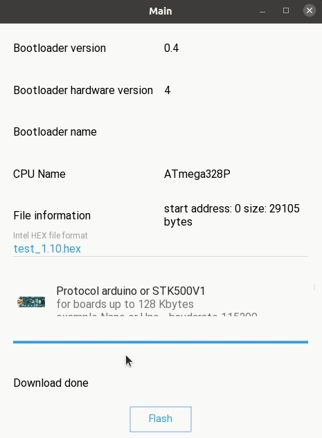

Kivy App Example
==========================================

As an example of use, there is an `APP <https://github.com/jjsch-dev/PyArduinoFlash/blob/master/kivymd/main.py>`_ in `KivyMd <https://gitlab.com/kivymd/KivyMD>`_ and `Kivy <http://kivy.org>`_ that exposes through a GUI all the methods required to update and verify the firmware.

The first example shows the upgrade of a Nano board that have the OptiBoot bootolader.
Select STK500-V1 at 115200 baud.

The second example shows the upgrade of a Mega board with 2560 processor.
STK500-V2 must be selected at 115200 baud.

