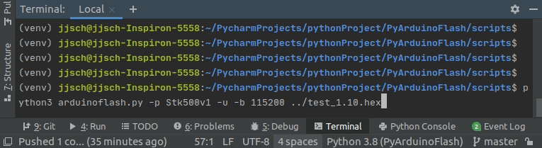
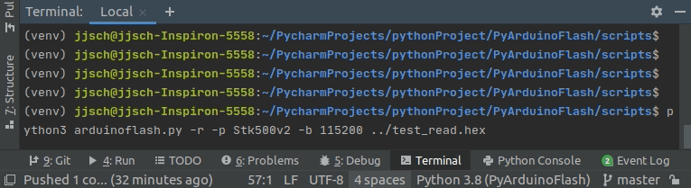

Script Example
==========================================
The Script folder contains `arduinoflash.py <https://github.com/jjsch-dev/PyArduinoFlash/tree/master/scripts/arduinoflash.py>`_ file that allows update or read the firmware of Arduino boards.

One of the purposes is to show the use of the PyArduinoBootloader library in conjunction with the `IntelHex <https://github.com/python-intelhex/intelhex>`_ library to process hexadecimal files.

Use the `argparse <https://docs.python.org/3/library/argparse.html#module-argparse>`_ library, to read the command line (file and options).

And to indicate the progress the `progressbar2 <https://pypi.org/project/progressbar2/>`_ library.

.. code:: shell-session:

    usage: arduinoflash.py [-h] [--version] [-r | -u] filename

    arduino flash utility

    positional arguments:
      filename      filename in hexadecimal Intel format

    optional arguments:
      -h, --help    show this help message and exit
      --version     script version
      -b BAUDRATE, --baudrate BAUDRATE
                            old bootolader (57600) Optiboot (115200)
      -p PROGRAMMER, --programmer PROGRAMMER
                            programmer version - Nano (Stk500v1) Mega (Stk500v2)
      -r, --read            read the cpu flash memory
      -u, --update          update cpu flash memory

The following capture shows the reading of the flash memory of an Arduino Nano board.

.. image:: images/arduinoflash_read_stk500v1.gif

And the next shows the firmware update of an Arduino Nano board.

The following capture shows the reading of the flash memory of an Arduino Mega 2560 board.

And the next shows the firmware update of an Arduino Mega 2560 board.

.. image:: images/arduinoflash_update_stk500v2.gif

