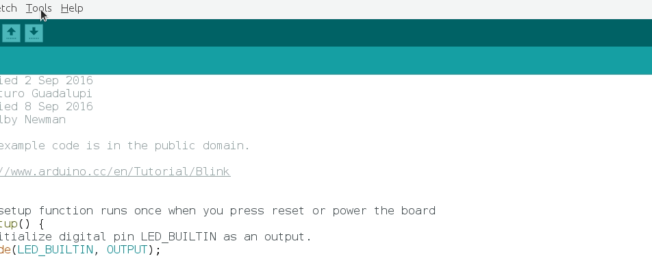

Description
==========================================

ArduinoBootloader is an open source library in Python for updating the firmware
of Arduino boards that use the `ATmegaBOOT_168 <https://github.com/arduino/ArduinoCore-avr/tree/master/bootloaders/atmega>`_ or `Stk500V2 <https://github.com/arduino/Arduino-stk500v2-bootloader>`_ bootloader, for example `Arduino Nano <https://store.arduino.cc/usa/arduino-nano>`_ or `Arduino Uno <https://store.arduino.cc/usa/arduino-uno-rev3>`_ or `Arduino Mega 2560 <https://store.arduino.cc/usa/mega-2560-r3>`_ and many more.

The intention is to have a class that can be imported into any Python project to update the Arduino's through the serial port.

It implements a subset of Atmel's STK-500V1 and STK500V2 protocol, using as reference the protocols implemented by `Avrdude <http://savannah.nongnu.org/projects/avrdude>`_ in the ```arduino.c``` and ```wiring.c``` modules.

For Arduino's using Atmel AVR8 processors there are three versions of the bootoloader available.

Up to 128 Kbytes - Old Version
##############################
For boards that have less than 128 Kbytes of Flash memory, for example Nano using the Atmega328P, etc that are marked in the Arduino IDE as older you have to use:

.. code-block:: python

    from arduinobootloader import ArduinoBootloader

    def update(self):
        ab = ArduinoBootloader()
        prg = ab.select_programmer("Stk500v1")

        if prg.open(speed=57600):


Up to 128 Kbytes - (Optiboot)
#############################
And for the new ones (they implement the Optiboot bootloader) you have to use:

.. code-block:: python

    from arduinobootloader import ArduinoBootloader

    def update(self):
        ab = ArduinoBootloader()
        prg = ab.select_programmer("Stk500v1")

        if prg.open(speed=115200):


More than 128 Kbytes
####################
For boards that have processors of more than 128 Kbytes, for example the Mega 2560, use:

.. code-block:: python

    from arduinobootloader import ArduinoBootloader

    def update(self):
        ab = ArduinoBootloader()
        prg = ab.select_programmer("Stk500v2")

        if prg.open(speed=115200):

